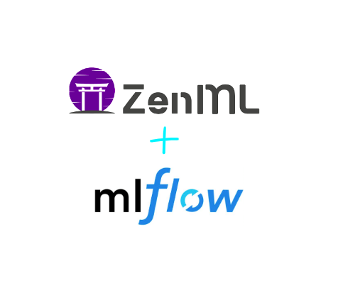
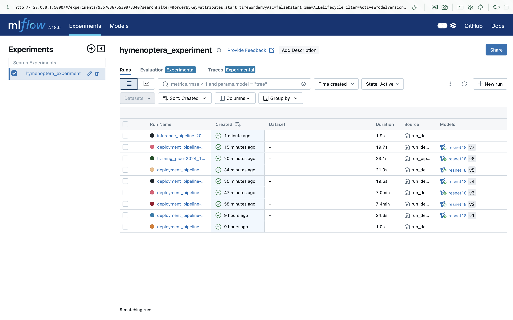
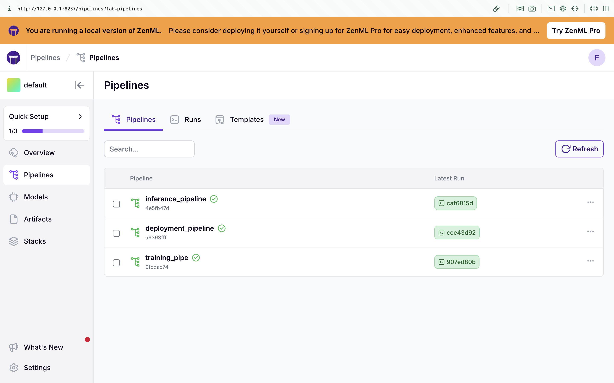
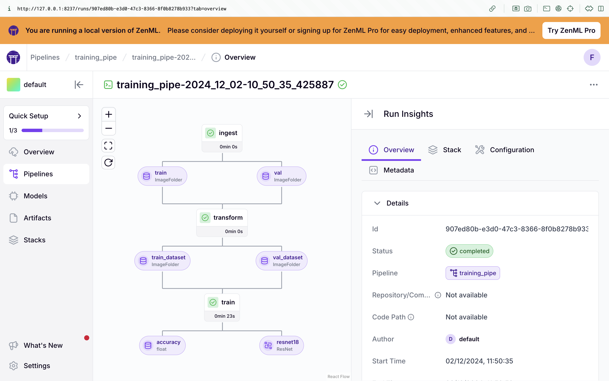
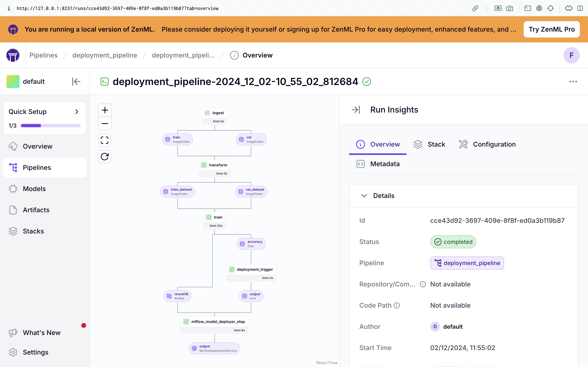
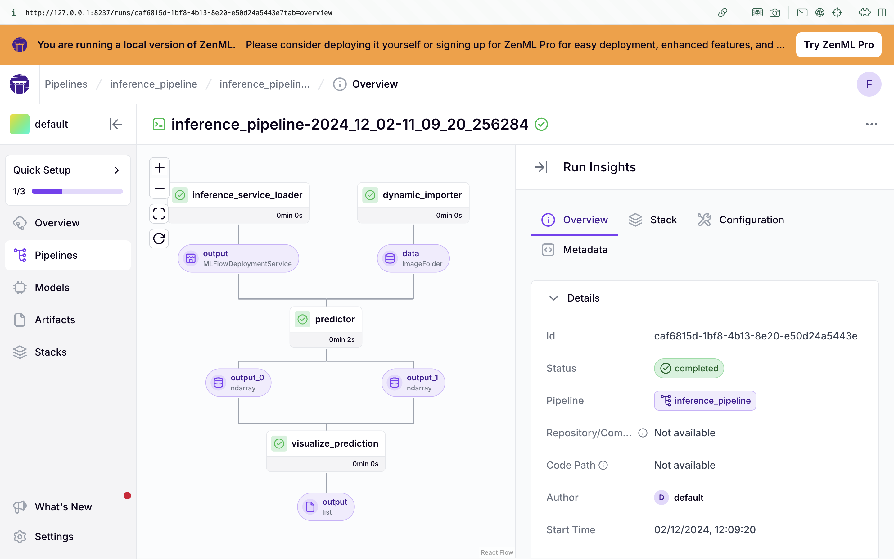

   

 

  

  <h3 align="center">ZenML + mlflow</h3>

  

    A project to explore and learn about ZenML and mlflow using the hymenoptera dataset from PyTorch
 

### Screenshots

<!-- LICENSE -->
## License

Distributed under the MIT License. See `LICENSE` for more information.
